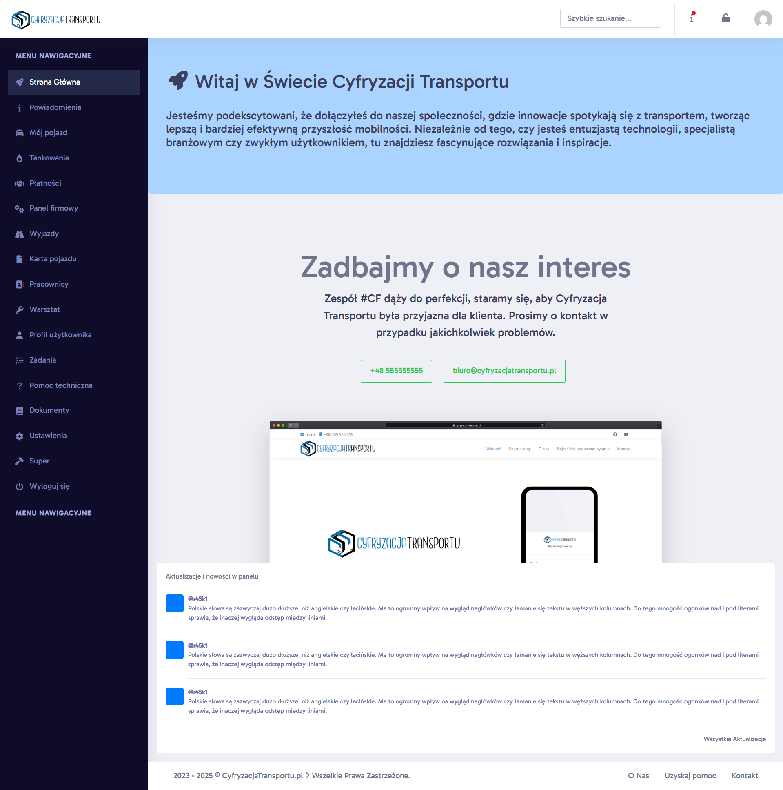
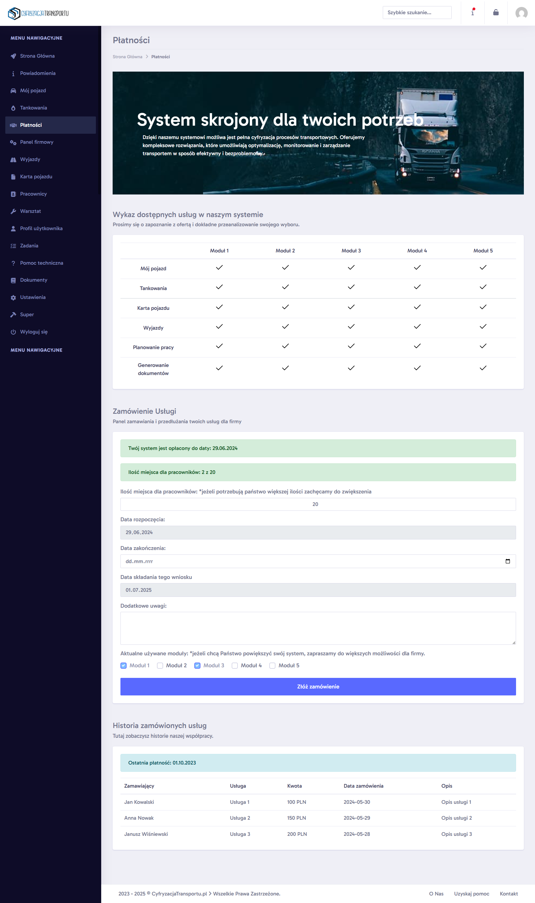

# Cyfryzacja Transportu - Truck Company Admin/User System

A web-based system designed to manage admins and users for a trucking company.  
The system allows user registration, role management, and tracking of trucking operations.

## Features

- User and admin management  
- Fleet management
- Real-time tracking of trucks  
- Responsive design for desktop and mobile
- Vehicle fleet management system, including vehicle and trailer cards
- Fuel consumption calculation
- Reporting vehicle defects to the workshop
- assigning orders to drivers

## Screenshots

### Dashboard  

### Dashborad menagment 

